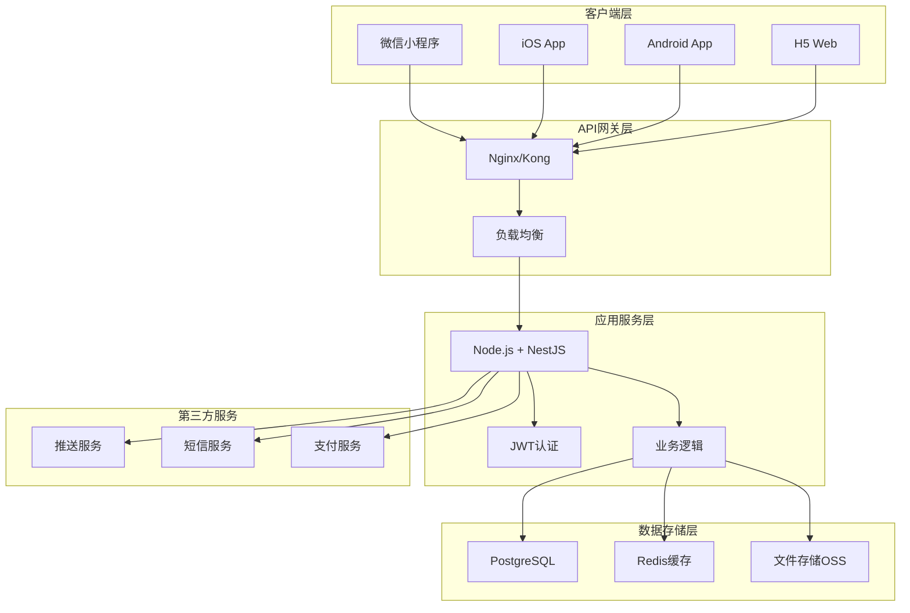

# 家庭记账本 - 小程序/App 技术选型建议

## 1. 整体架构概览



## 2. 后端技术选型

### 2.1 核心框架

**推荐：Node.js + NestJS**

**选择理由：**
- **TypeScript支持**：类型安全，减少运行时错误
- **装饰器模式**：代码简洁，易于维护
- **模块化架构**：便于团队协作和代码复用
- **丰富的生态**：大量第三方库支持
- **性能优秀**：非阻塞I/O，适合高并发场景
- **开发效率高**：前后端统一语言，降低学习成本

**核心依赖包：**
```json
{
  "dependencies": {
    "@nestjs/core": "^10.0.0",
    "@nestjs/common": "^10.0.0",
    "@nestjs/platform-express": "^10.0.0",
    "@nestjs/swagger": "^7.0.0",
    "@nestjs/jwt": "^10.0.0",
    "@nestjs/passport": "^10.0.0",
    "@nestjs/throttler": "^5.0.0",
    "@nestjs/schedule": "^4.0.0",
    "@prisma/client": "^5.0.0",
    "prisma": "^5.0.0",
    "passport-jwt": "^4.0.1",
    "bcryptjs": "^2.4.3",
    "class-validator": "^0.14.0",
    "class-transformer": "^0.5.1",
    "redis": "^4.6.0",
    "@nestjs-modules/ioredis": "^2.0.0",
    "multer": "^1.4.5",
    "sharp": "^0.32.0",
    "dayjs": "^1.11.0",
    "uuid": "^9.0.0"
  },
  "devDependencies": {
    "@types/node": "^20.0.0",
    "@types/bcryptjs": "^2.4.2",
    "@types/multer": "^1.4.7",
    "@types/uuid": "^9.0.0",
    "typescript": "^5.0.0",
    "ts-node": "^10.9.0",
    "nodemon": "^3.0.0",
    "jest": "^29.0.0",
    "supertest": "^6.3.0"
  }
}
```

### 2.2 数据库选型

**主数据库：PostgreSQL 15+**

**选择理由：**
- **ACID事务支持**：确保数据一致性
- **JSON支持**：灵活存储复杂数据结构
- **丰富的数据类型**：支持数组、枚举等
- **强大的查询能力**：支持复杂统计分析
- **高性能**：优秀的并发处理能力
- **开源免费**：降低成本

**ORM：Prisma**

**选择理由：**
- **类型安全**：自动生成TypeScript类型
- **直观的查询API**：易于理解和使用
- **数据库迁移**：版本控制友好
- **性能优化**：查询优化和连接池
- **多数据库支持**：便于后期扩展

**缓存数据库：Redis 7+**

**使用场景：**
- 用户会话存储
- 热点数据缓存
- 分布式锁
- 消息队列
- 限流计数器

### 2.3 认证授权

**JWT (JSON Web Token)**

**实现方案：**
```typescript
// JWT配置
{
  secret: process.env.JWT_SECRET,
  signOptions: {
    expiresIn: '7d', // 7天有效期
    issuer: 'family-ledger',
    audience: 'mobile-app'
  }
}

// Token刷新策略
{
  accessToken: '2h',  // 访问令牌2小时
  refreshToken: '30d' // 刷新令牌30天
}
```

**安全增强：**
- Token黑名单机制
- 设备指纹验证
- IP白名单（可选）
- 异常登录检测

### 2.4 文件存储

**推荐：阿里云OSS / 腾讯云COS**

**配置示例：**
```typescript
// 文件上传配置
{
  maxFileSize: 10 * 1024 * 1024, // 10MB
  allowedMimeTypes: [
    'image/jpeg',
    'image/png',
    'image/webp',
    'application/pdf'
  ],
  uploadPath: 'family-ledger/{year}/{month}/',
  thumbnailSizes: [150, 300, 600]
}
```

## 3. 小程序技术选型

### 3.1 微信小程序

**开发框架：Taro 3.x + React**

**选择理由：**
- **一套代码多端运行**：支持微信、支付宝、百度等小程序
- **React生态**：丰富的组件库和工具链
- **TypeScript支持**：类型安全开发
- **热更新**：开发效率高
- **社区活跃**：问题解决快

**核心依赖：**
```json
{
  "dependencies": {
    "@tarojs/components": "3.6.0",
    "@tarojs/runtime": "3.6.0",
    "@tarojs/taro": "3.6.0",
    "@tarojs/plugin-platform-weapp": "3.6.0",
    "react": "^18.0.0",
    "react-dom": "^18.0.0",
    "@nutui/nutui-react-taro": "^2.0.0",
    "dayjs": "^1.11.0",
    "zustand": "^4.4.0",
    "@tanstack/react-query": "^4.0.0"
  }
}
```

**状态管理：Zustand**

**选择理由：**
- **轻量级**：包体积小
- **简单易用**：学习成本低
- **TypeScript友好**：完美类型支持
- **性能优秀**：按需更新

**数据请求：TanStack Query (React Query)**

**功能特性：**
- 自动缓存管理
- 后台数据同步
- 离线支持
- 乐观更新
- 错误重试

### 3.2 UI组件库

**推荐：NutUI React (京东)**

**选择理由：**
- **专为移动端设计**：组件丰富
- **Taro适配良好**：官方支持
- **主题定制**：符合品牌需求
- **性能优化**：按需加载
- **文档完善**：上手容易

**核心组件：**
- Button、Input、Form 表单组件
- Picker、DatePicker 选择器
- Swipe、Tabs 导航组件
- Toast、Dialog 反馈组件
- PullRefresh、InfiniteLoading 列表组件

### 3.3 小程序特殊功能

**本地存储策略：**
```typescript
// 数据分层存储
{
  // 用户配置 - Storage
  userSettings: 'wx.setStorageSync',
  
  // 临时数据 - 内存
  tempData: 'zustand store',
  
  // 离线数据 - SQLite
  offlineTransactions: 'wx.createSQLiteDatabase'
}
```

**离线功能实现：**
```typescript
// 离线数据同步
class OfflineSync {
  // 本地数据库
  private db: WechatMiniprogram.Database;
  
  // 同步队列
  private syncQueue: Transaction[] = [];
  
  // 网络状态监听
  onNetworkStatusChange() {
    wx.onNetworkStatusChange((res) => {
      if (res.isConnected) {
        this.syncToServer();
      }
    });
  }
  
  // 离线记账
  async addOfflineTransaction(transaction: Transaction) {
    // 生成本地ID
    transaction.id = `local_${Date.now()}`;
    
    // 保存到本地数据库
    await this.db.collection('transactions').add({
      data: transaction
    });
    
    // 添加到同步队列
    this.syncQueue.push(transaction);
    
    // 尝试同步
    if (this.isOnline()) {
      this.syncToServer();
    }
  }
}
```

## 4. App技术选型

### 4.1 跨平台方案

**推荐：React Native 0.72+**

**选择理由：**
- **原生性能**：接近原生应用体验
- **代码复用**：iOS/Android共享代码
- **生态丰富**：大量第三方库
- **热更新**：支持CodePush
- **社区活跃**：Facebook官方维护

**核心依赖：**
```json
{
  "dependencies": {
    "react": "18.2.0",
    "react-native": "0.72.0",
    "@react-navigation/native": "^6.1.0",
    "@react-navigation/stack": "^6.3.0",
    "@react-navigation/bottom-tabs": "^6.5.0",
    "react-native-screens": "^3.25.0",
    "react-native-safe-area-context": "^4.7.0",
    "@reduxjs/toolkit": "^1.9.0",
    "react-redux": "^8.1.0",
    "@tanstack/react-query": "^4.0.0",
    "react-native-async-storage": "^1.19.0",
    "react-native-sqlite-storage": "^6.0.1",
    "react-native-image-picker": "^5.6.0",
    "react-native-push-notification": "^8.1.1",
    "react-native-biometrics": "^3.0.1",
    "react-native-keychain": "^8.1.0"
  }
}
```

### 4.2 状态管理

**Redux Toolkit + React Query**

**架构设计：**
```typescript
// 全局状态 - Redux Toolkit
interface RootState {
  auth: AuthState;      // 用户认证状态
  app: AppState;        // 应用配置状态
  offline: OfflineState; // 离线数据状态
}

// 服务端状态 - React Query
const queryClient = new QueryClient({
  defaultOptions: {
    queries: {
      staleTime: 5 * 60 * 1000, // 5分钟
      cacheTime: 10 * 60 * 1000, // 10分钟
      retry: 3,
      refetchOnWindowFocus: false,
    },
  },
});
```

### 4.3 本地数据库

**SQLite + react-native-sqlite-storage**

**数据库设计：**
```sql
-- 离线交易表
CREATE TABLE offline_transactions (
  id TEXT PRIMARY KEY,
  ledger_id TEXT NOT NULL,
  type TEXT NOT NULL,
  amount REAL NOT NULL,
  description TEXT,
  date TEXT NOT NULL,
  category_id TEXT NOT NULL,
  account_id TEXT NOT NULL,
  images TEXT, -- JSON数组
  sync_status INTEGER DEFAULT 0, -- 0:未同步 1:已同步 2:冲突
  created_at TEXT NOT NULL,
  updated_at TEXT NOT NULL
);

-- 缓存数据表
CREATE TABLE cache_data (
  key TEXT PRIMARY KEY,
  value TEXT NOT NULL,
  expires_at INTEGER NOT NULL,
  created_at INTEGER NOT NULL
);
```

### 4.4 原生功能集成

**生物识别认证：**
```typescript
import TouchID from 'react-native-touch-id';

class BiometricAuth {
  async authenticate(): Promise<boolean> {
    try {
      const biometryType = await TouchID.isSupported();
      
      if (biometryType) {
        await TouchID.authenticate('请验证您的身份', {
          title: '生物识别验证',
          subtitle: '使用指纹或面容ID快速登录',
          fallbackLabel: '使用密码',
          cancelLabel: '取消',
        });
        return true;
      }
      
      return false;
    } catch (error) {
      console.log('生物识别失败:', error);
      return false;
    }
  }
}
```

**推送通知：**
```typescript
import PushNotification from 'react-native-push-notification';

class NotificationService {
  configure() {
    PushNotification.configure({
      onRegister: (token) => {
        console.log('推送Token:', token);
        // 发送到服务器
        this.registerDevice(token.token);
      },
      
      onNotification: (notification) => {
        console.log('收到通知:', notification);
        
        if (notification.userInteraction) {
          // 用户点击通知
          this.handleNotificationTap(notification);
        }
      },
      
      permissions: {
        alert: true,
        badge: true,
        sound: true,
      },
      
      popInitialNotification: true,
      requestPermissions: true,
    });
  }
}
```

## 5. API设计规范

### 5.1 RESTful API设计

**URL命名规范：**
```
# 资源命名使用复数
GET    /api/v1/ledgers           # 获取账本列表
POST   /api/v1/ledgers           # 创建账本
GET    /api/v1/ledgers/{id}      # 获取账本详情
PATCH  /api/v1/ledgers/{id}      # 更新账本
DELETE /api/v1/ledgers/{id}      # 删除账本

# 嵌套资源
GET    /api/v1/ledgers/{id}/transactions  # 获取账本交易记录
POST   /api/v1/ledgers/{id}/transactions  # 创建交易记录

# 操作性接口使用动词
POST   /api/v1/ledgers/{id}/invite        # 邀请成员
POST   /api/v1/ledgers/join               # 加入账本
POST   /api/v1/auth/login                 # 用户登录
POST   /api/v1/auth/refresh               # 刷新Token
```

### 5.2 响应格式标准化

**成功响应：**
```typescript
interface ApiResponse<T> {
  success: true;
  data: T;
  message?: string;
  timestamp: string;
  requestId: string;
}
```

**错误响应：**
```typescript
interface ApiError {
  success: false;
  error: {
    code: string;
    message: string;
    details?: any;
  };
  timestamp: string;
  requestId: string;
}
```

### 5.3 分页和过滤

**查询参数标准：**
```typescript
interface QueryParams {
  // 分页
  page?: number;        // 页码，从1开始
  limit?: number;       // 每页数量，默认20，最大100
  
  // 排序
  sort?: string;        // 排序字段
  order?: 'asc' | 'desc'; // 排序方向
  
  // 过滤
  filter?: {
    [key: string]: any;
  };
  
  // 搜索
  search?: string;      // 关键词搜索
  
  // 时间范围
  startDate?: string;   // 开始日期
  endDate?: string;     // 结束日期
}
```

## 6. 性能优化策略

### 6.1 后端优化

**数据库优化：**
```sql
-- 索引优化
CREATE INDEX CONCURRENTLY idx_transactions_ledger_date 
ON transactions(ledger_id, date DESC);

CREATE INDEX CONCURRENTLY idx_transactions_search 
ON transactions USING gin(to_tsvector('simple', description));

-- 分区表（大数据量时）
CREATE TABLE transactions_2024 PARTITION OF transactions
FOR VALUES FROM ('2024-01-01') TO ('2025-01-01');
```

**缓存策略：**
```typescript
// 多级缓存
class CacheManager {
  // L1: 内存缓存（应用级）
  private memoryCache = new Map();
  
  // L2: Redis缓存（分布式）
  private redisCache: Redis;
  
  // L3: 数据库（持久化）
  private database: PrismaClient;
  
  async get(key: string) {
    // 1. 检查内存缓存
    if (this.memoryCache.has(key)) {
      return this.memoryCache.get(key);
    }
    
    // 2. 检查Redis缓存
    const redisValue = await this.redisCache.get(key);
    if (redisValue) {
      this.memoryCache.set(key, JSON.parse(redisValue));
      return JSON.parse(redisValue);
    }
    
    // 3. 从数据库获取
    const dbValue = await this.database.findUnique(/* ... */);
    if (dbValue) {
      await this.set(key, dbValue);
      return dbValue;
    }
    
    return null;
  }
}
```

### 6.2 前端优化

**小程序优化：**
```typescript
// 代码分包
{
  "pages": [
    "pages/index/index",
    "pages/ledger/ledger"
  ],
  "subPackages": [
    {
      "root": "pages/report",
      "pages": [
        "index",
        "detail"
      ]
    },
    {
      "root": "pages/settings",
      "pages": [
        "index",
        "profile"
      ]
    }
  ],
  "preloadRule": {
    "pages/index/index": {
      "network": "all",
      "packages": ["pages/report"]
    }
  }
}

// 图片优化
const optimizeImage = (url: string, width: number) => {
  return `${url}?x-oss-process=image/resize,w_${width}/quality,q_80/format,webp`;
};

// 虚拟列表
import { VirtualList } from '@nutui/nutui-react-taro';

const TransactionList = () => {
  return (
    <VirtualList
      itemHeight={80}
      itemCount={transactions.length}
      renderItem={({ index }) => (
        <TransactionItem transaction={transactions[index]} />
      )}
    />
  );
};
```

**App优化：**
```typescript
// 懒加载
const LazyScreen = React.lazy(() => import('./screens/ReportScreen'));

// 图片缓存
import FastImage from 'react-native-fast-image';

const CachedImage = ({ uri, ...props }) => (
  <FastImage
    source={{
      uri,
      priority: FastImage.priority.normal,
      cache: FastImage.cacheControl.immutable,
    }}
    {...props}
  />
);

// 列表优化
import { FlatList } from 'react-native';

const OptimizedList = () => {
  const renderItem = useCallback(({ item }) => (
    <TransactionItem transaction={item} />
  ), []);
  
  const keyExtractor = useCallback((item) => item.id, []);
  
  return (
    <FlatList
      data={transactions}
      renderItem={renderItem}
      keyExtractor={keyExtractor}
      removeClippedSubviews={true}
      maxToRenderPerBatch={10}
      windowSize={10}
      initialNumToRender={20}
      getItemLayout={(data, index) => ({
        length: 80,
        offset: 80 * index,
        index,
      })}
    />
  );
};
```

## 7. 部署和运维

### 7.1 容器化部署

**Dockerfile：**
```dockerfile
# 多阶段构建
FROM node:18-alpine AS builder

WORKDIR /app
COPY package*.json ./
RUN npm ci --only=production

COPY . .
RUN npm run build

# 生产镜像
FROM node:18-alpine AS production

WORKDIR /app
COPY --from=builder /app/dist ./dist
COPY --from=builder /app/node_modules ./node_modules
COPY --from=builder /app/package.json ./package.json

EXPOSE 3000

USER node
CMD ["node", "dist/main.js"]
```

**docker-compose.yml：**
```yaml
version: '3.8'

services:
  app:
    build: .
    ports:
      - "3000:3000"
    environment:
      - NODE_ENV=production
      - DATABASE_URL=postgresql://user:pass@db:5432/family_ledger
      - REDIS_URL=redis://redis:6379
    depends_on:
      - db
      - redis
    restart: unless-stopped

  db:
    image: postgres:15-alpine
    environment:
      - POSTGRES_DB=family_ledger
      - POSTGRES_USER=user
      - POSTGRES_PASSWORD=pass
    volumes:
      - postgres_data:/var/lib/postgresql/data
    restart: unless-stopped

  redis:
    image: redis:7-alpine
    restart: unless-stopped

  nginx:
    image: nginx:alpine
    ports:
      - "80:80"
      - "443:443"
    volumes:
      - ./nginx.conf:/etc/nginx/nginx.conf
      - ./ssl:/etc/nginx/ssl
    depends_on:
      - app
    restart: unless-stopped

volumes:
  postgres_data:
```

### 7.2 监控和日志

**应用监控：**
```typescript
// 健康检查
@Controller('health')
export class HealthController {
  constructor(
    private prisma: PrismaService,
    private redis: RedisService,
  ) {}

  @Get()
  async check() {
    const checks = await Promise.allSettled([
      this.checkDatabase(),
      this.checkRedis(),
      this.checkMemory(),
    ]);

    const status = checks.every(check => check.status === 'fulfilled') 
      ? 'healthy' 
      : 'unhealthy';

    return {
      status,
      timestamp: new Date().toISOString(),
      checks: {
        database: checks[0].status,
        redis: checks[1].status,
        memory: checks[2].status,
      },
    };
  }

  private async checkDatabase() {
    await this.prisma.$queryRaw`SELECT 1`;
  }

  private async checkRedis() {
    await this.redis.ping();
  }

  private checkMemory() {
    const usage = process.memoryUsage();
    const threshold = 1024 * 1024 * 1024; // 1GB
    
    if (usage.heapUsed > threshold) {
      throw new Error('Memory usage too high');
    }
  }
}
```

**日志配置：**
```typescript
// Winston日志配置
import { WinstonModule } from 'nest-winston';
import * as winston from 'winston';

const logger = WinstonModule.createLogger({
  transports: [
    new winston.transports.Console({
      format: winston.format.combine(
        winston.format.timestamp(),
        winston.format.colorize(),
        winston.format.simple(),
      ),
    }),
    new winston.transports.File({
      filename: 'logs/error.log',
      level: 'error',
      format: winston.format.combine(
        winston.format.timestamp(),
        winston.format.json(),
      ),
    }),
    new winston.transports.File({
      filename: 'logs/combined.log',
      format: winston.format.combine(
        winston.format.timestamp(),
        winston.format.json(),
      ),
    }),
  ],
});
```

## 8. 安全最佳实践

### 8.1 API安全

**请求验证：**
```typescript
// 请求签名验证
@Injectable()
export class SignatureGuard implements CanActivate {
  canActivate(context: ExecutionContext): boolean {
    const request = context.switchToHttp().getRequest();
    const signature = request.headers['x-signature'];
    const timestamp = request.headers['x-timestamp'];
    const nonce = request.headers['x-nonce'];
    
    // 验证时间戳（防重放攻击）
    const now = Date.now();
    if (Math.abs(now - parseInt(timestamp)) > 300000) { // 5分钟
      throw new UnauthorizedException('请求已过期');
    }
    
    // 验证签名
    const expectedSignature = this.generateSignature(
      request.body,
      timestamp,
      nonce
    );
    
    if (signature !== expectedSignature) {
      throw new UnauthorizedException('签名验证失败');
    }
    
    return true;
  }
}

// 限流配置
@UseGuards(ThrottlerGuard)
@Throttle(100, 60) // 每分钟100次请求
export class TransactionsController {
  // ...
}
```

**数据加密：**
```typescript
// 敏感数据加密
import * as crypto from 'crypto';

class EncryptionService {
  private readonly algorithm = 'aes-256-gcm';
  private readonly key = Buffer.from(process.env.ENCRYPTION_KEY, 'hex');
  
  encrypt(text: string): string {
    const iv = crypto.randomBytes(16);
    const cipher = crypto.createCipher(this.algorithm, this.key);
    cipher.setAAD(Buffer.from('family-ledger'));
    
    let encrypted = cipher.update(text, 'utf8', 'hex');
    encrypted += cipher.final('hex');
    
    const authTag = cipher.getAuthTag();
    
    return `${iv.toString('hex')}:${authTag.toString('hex')}:${encrypted}`;
  }
  
  decrypt(encryptedData: string): string {
    const [ivHex, authTagHex, encrypted] = encryptedData.split(':');
    
    const iv = Buffer.from(ivHex, 'hex');
    const authTag = Buffer.from(authTagHex, 'hex');
    
    const decipher = crypto.createDecipher(this.algorithm, this.key);
    decipher.setAAD(Buffer.from('family-ledger'));
    decipher.setAuthTag(authTag);
    
    let decrypted = decipher.update(encrypted, 'hex', 'utf8');
    decrypted += decipher.final('utf8');
    
    return decrypted;
  }
}
```

### 8.2 客户端安全

**小程序安全：**
```typescript
// 代码混淆
// 使用微信小程序代码保护功能

// 敏感数据存储
class SecureStorage {
  private static encrypt(data: string): string {
    // 使用微信提供的加密API
    return wx.arrayBufferToBase64(
      wx.crypto.getRandomValues(new Uint8Array(16))
    );
  }
  
  static setSecureItem(key: string, value: any): void {
    const encrypted = this.encrypt(JSON.stringify(value));
    wx.setStorageSync(key, encrypted);
  }
  
  static getSecureItem(key: string): any {
    const encrypted = wx.getStorageSync(key);
    if (!encrypted) return null;
    
    try {
      const decrypted = this.decrypt(encrypted);
      return JSON.parse(decrypted);
    } catch {
      return null;
    }
  }
}
```

**App安全：**
```typescript
// 证书绑定
import { NetworkingModule } from 'react-native';

const secureApiClient = axios.create({
  baseURL: 'https://api.family-ledger.com',
  timeout: 10000,
  // SSL证书验证
  httpsAgent: new https.Agent({
    rejectUnauthorized: true,
    checkServerIdentity: (host, cert) => {
      // 证书绑定验证
      const expectedFingerprint = 'SHA256:...';
      const actualFingerprint = cert.fingerprint256;
      
      if (actualFingerprint !== expectedFingerprint) {
        throw new Error('证书验证失败');
      }
    },
  }),
});

// Root检测
import JailMonkey from 'jail-monkey';

class SecurityCheck {
  static async checkDeviceSecurity(): Promise<boolean> {
    const checks = {
      isJailBroken: JailMonkey.isJailBroken(),
      isOnExternalStorage: JailMonkey.isOnExternalStorage(),
      isDebuggedMode: JailMonkey.isDebuggedMode(),
    };
    
    const isSecure = Object.values(checks).every(check => !check);
    
    if (!isSecure) {
      console.warn('设备安全检查失败:', checks);
    }
    
    return isSecure;
  }
}
```

这套技术选型方案为小程序和App提供了完整的技术支撑，涵盖了从后端架构到前端实现的各个方面，确保应用的性能、安全性和可维护性。