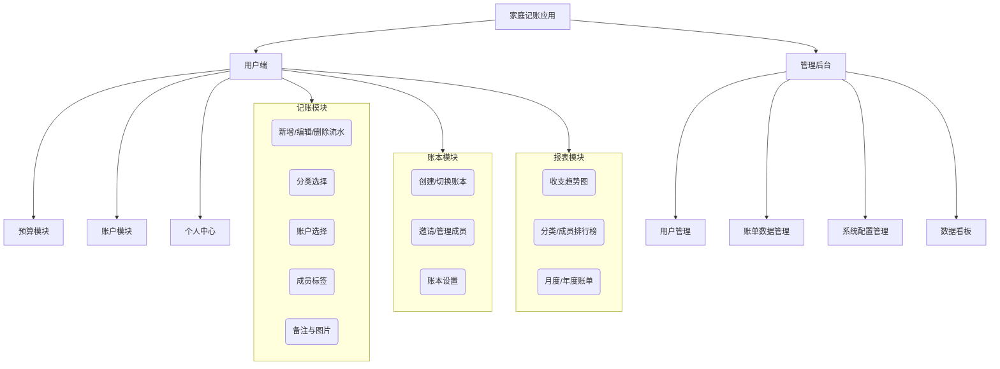
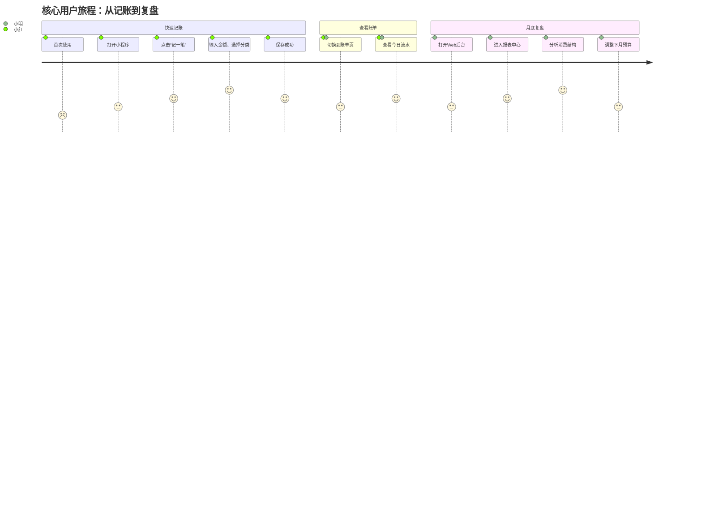

# 产品需求文档 (PRD) - 家庭记账应用

---

## 1. 文档信息

### 1.1 版本历史

| 版本号 | 主要变更内容 | 作者 | 日期 |
| :--- | :--- | :--- | :--- |
| V1.0 | 初始草案创建 | 产品经理 | 2024-07-24 |

### 1.2 文档目的

本文档旨在详细说明“家庭记账应用”的产品需求，为设计、开发、测试和运营等后续工作提供明确、统一的指导和依据。本文档定义了产品的目标、功能、非功能需求以及成功标准。

### 1.3 相关文档引用

- [产品路线图 (Roadmap)](./Roadmap.md)
- [用户故事地图 (User Story Map)](./User_Story_Map.md)
- [产品评估指标框架 (Metrics Framework)](./Metrics_Framework.md)

---

## 2. 产品概述

### 2.1 产品名称与定位

- **产品名称**: 家庭账本
- **产品定位**: 一款专为现代家庭设计的，简洁、智能、多平台同步的财务管理工具，帮助家庭成员共同记录、分析和规划家庭收支。

### 2.2 产品愿景与使命

- **愿景**: 成为每个家庭信赖的财务健康伙伴。
- **使命**: 通过科技手段简化家庭记账流程，提升家庭财务管理效率，促进家庭成员间的财务沟通与协作。

### 2.3 价值主张与独特卖点 (USP)

- **核心价值**: 清晰、便捷、共享。
- **独特卖点**:
  - **多平台无缝同步**: 小程序、App、Web后台数据实时同步，满足不同场景下的使用需求。
  - **家庭成员共享账本**: 支持邀请家庭成员共同记账，账目清晰，责任明确。
  - **智能化报表分析**: 自动生成多维度收支报表，提供预算预警，帮助家庭洞察消费习惯。

### 2.4 目标平台列表

- **客户端**: 
  - 微信小程序
  - iOS App
  - Android App
- **管理端**:
  - Web后台管理系统

### 2.5 产品核心假设

- 用户愿意花少量时间记录日常开销，以换取清晰的财务状况和长期的财务规划。
- 家庭成员之间存在共同记账和管理家庭财务的需求。
- 用户偏好在移动设备（小程序/App）上进行快速记账，而在Web端进行复杂的管理和数据分析。

### 2.6 商业模式概述

- **初期 (MVP)**: 免费使用，聚焦用户增长和产品打磨。
- **中期**: 推出增值服务 (Freemium模式)，例如：
  - 高级图表与数据导出功能。
  - 更多自定义账本封面、分类图标。
  - AI财务规划建议。
- **长期**: 探索与金融机构合作，提供理财产品推荐等服务。

---

## 3. 用户研究

### 3.1 目标用户画像

#### 3.1.1 画像一：年轻夫妻/情侣 (主要用户)

- **人口统计特征**: 25-35岁，已婚或稳定关系，居住在一二线城市，互联网从业者、白领居多。
- **行为习惯与偏好**: 习惯使用智能手机和各类App，对新鲜事物接受度高，注重生活品质，有共同的财务目标（如买房、买车、育儿）。
- **核心需求与痛点**:
  - **需求**: 希望能方便地记录两人共同的开销，了解家庭总体的收支情况。
  - **痛点**: 使用单人记账软件无法有效区分个人和共同花费；通过Excel或备忘录记账繁琐且易遗漏；对家庭整体财务状况缺乏清晰认知，容易因钱的问题产生分歧。
- **动机与目标**: 共同储蓄，为未来做规划，提高资金使用效率，减少不必要的开支。

#### 3.1.2 画像二：有子女的家庭主理人

- **人口统计特征**: 30-45岁，通常是家庭中更关注财务管理的一方（如全职妈妈、细心的爸爸），对家庭开销精打细算。
- **行为习惯与偏好**: 关注各类生活优惠信息，擅长规划家庭生活，对子女教育、家庭健康等大额支出尤为关注。
- **核心需求与痛点**:
  - **需求**: 需要一个工具来系统地记录家庭的每一笔开销，特别是围绕孩子的花费，并设置预算。
  - **痛点**: 家庭开销项目繁多，手动分类困难；难以追踪预算执行情况，经常超支；希望了解钱都花在了哪里。
- **动机与目标**: 控制家庭开支，优化消费结构，确保家庭财务健康，为子女提供更好的生活和教育条件。

### 3.2 用户场景分析

- **核心使用场景**:
  - **场景1：日常消费记账**
    - **描述**: 小明和妻子小红下班后去超市购物，花费了280元。小红在回家的地铁上，打开微信小程序，快速记录了这笔“餐饮购物”支出，并标记为“家庭共同”支出。
  - **场景2：月底复盘与预算设置**
    - **描述**: 月底，小明在电脑上登录Web后台，查看本月的家庭收支总览报表。他发现本月在“娱乐”上的花费超出了预算。他和妻子商量后，调整了下个月的预算，并设定了超支提醒。
  - **场景3：家庭成员查账**
    - **描述**: 爸爸为孩子报了游泳课，用自己的信用卡支付了3000元。他在App上记录了这笔“教育培训”支出。妈妈在自己的手机上立即看到了这笔记录，了解了家庭资金的动向。
- **边缘使用场景**:
  - 记录周期性收支（如房租、工资）。
  - 记录家庭成员间的内部转账或借还款。
  - 导出账单用于报销或其他证明。

---

## 4. 市场与竞品分析

*(此部分将在后续的详细分析中填充)*

- 4.1 市场规模与增长预测
- 4.2 行业趋势分析
- 4.3 竞争格局分析 (例如：鲨鱼记账、随手记、Timi时光记账等)
- 4.4 竞品功能对比矩阵
- 4.5 市场差异化策略

---

## 5. 产品功能需求

### 5.1 功能架构与模块划分

### 5.2 核心功能详述 (MVP版本)

#### 5.2.1 记账模块

- **用户故事**: 
  - 作为一名家庭成员，我想要快速记录一笔支出或收入，并选择对应的分类、账户和成员，以便让账目清晰明了。
- **用户价值**: 核心功能，满足用户最基本的记账需求，降低记账门槛。
- **功能逻辑与规则**:
  - 支持支出、收入、转账三种类型。
  - 金额为必填项，支持小数点后两位。
  - 分类：系统提供默认分类（衣食住行等），支持用户自定义一级和二级分类。
  - 日期：默认为当天，支持修改。
  - 账户：支持关联现金、银行卡、支付宝、微信等多种账户类型。
  - 成员：可选择参与该笔流水的家庭成员。
  - 备注：支持文字和图片上传（最多1张）。
- **验收标准**:
  - [ ] 用户可以成功添加一笔包含金额、分类、日期的支出流水。
  - [ ] 用户可以成功添加一笔收入流水。
  - [ ] 用户可以编辑和删除自己记录的流水。
  - [ ] 添加流水后，相关账户余额自动更新。

#### 5.2.2 账本模块

- **用户故事**:
  - 作为家庭的创建者，我想要创建一个家庭账本，并邀请我的伴侣加入，以便我们能一起记账。
- **用户价值**: 实现家庭共享记账的核心场景，是产品区别于个人记账软件的关键。
- **功能逻辑与规则**:
  - 每个用户默认拥有一个个人账本。
  - 用户可以创建新的家庭账本，并成为该账本的管理员。
  - 管理员可以通过链接或二维码邀请其他用户加入账本。
  - 成员加入后，可以看到账本内的所有流水，并进行记账。
- **验收标准**:
  - [ ] 用户可以成功创建一个新的家庭账本。
  - [ ] 账本管理员可以成功邀请成员加入。
  - [ ] 被邀请成员可以通过邀请链接成功加入账本。
  - [ ] 成员可以自由切换不同的账本（如个人账本和家庭账本）。

#### 5.2.3 报表模块

- **用户故事**:
  - 作为一名家庭成员，我想要查看本月的收支分类统计图表，以便了解家庭的消费结构。
- **用户价值**: 将枯燥的数据转化为直观的图表，帮助用户快速洞察财务状况。
- **功能逻辑与规则**:
  - 提供按月查看的收支趋势图（柱状图）。
  - 提供按月查看的支出分类占比图（饼图）。
  - 支持按分类、按成员、按时间筛选查看流水明细。
- **验收标准**:
  - [ ] 报表能正确显示当月的总收入、总支出和结余。
  - [ ] 饼图能准确反映各类支出的金额和占比。
  - [ ] 筛选功能可以正常工作，并展示正确的流水列表。

### 5.3 未来功能储备 (Backlog)

- 预算中心功能
- 周期记账功能
- 债务管理（借入/借出）
- 数据导出功能
- AI记账助手（语音记账、票据识别）

---

## 6. 用户流程与交互设计指导

### 6.1 核心用户旅程地图

### 6.2 对设计师 (UI/UX Agent) 的界面原型参考说明和要求

- **记账页面**: 
  - 操作应尽可能简化，突出数字输入键盘和常用分类。
  - “再记一笔”功能应放在用户完成一笔记账后的显眼位置，鼓励连续记录。
- **首页/账单流**: 
  - 信息层级清晰，突出显示当日/当月收支总额。
  - 流水列表应清晰展示金额、分类、备注等关键信息。
- **报表页面**: 
  - 图表设计应直观易懂，色彩搭配清晰。
  - 交互上支持点击图表区域查看对应明细。

---

## 7. 非功能需求

- **性能需求**: 
  - 页面加载时间：95%的页面应在2秒内加载完成。
  - 记账响应时间：提交记账请求后，后台处理时间应在500毫秒内。
- **安全需求**: 
  - 用户密码、支付信息等敏感数据必须加密存储。
  - API接口需进行身份认证和权限校验，防止数据泄露。
- **可用性需求**: 
  - 确保在主流手机型号和浏览器上表现一致。
  - 数据在多端（小程序、App、Web）之间同步延迟应小于5秒。
- **数据统计需求**: 
  - 需埋点跟踪核心事件：用户注册、每日活跃、记账次数、账本创建数、成员邀请数等。

---

## 8. 技术架构考量

- **技术栈建议**:
  - **后端**: Java (Spring Boot) / Go / Node.js (Express/NestJS)
  - **数据库**: MySQL / PostgreSQL + Redis (用于缓存)
  - **客户端(App)**: Flutter / React Native (实现跨平台开发)
  - **小程序**: 原生小程序框架或Taro/uni-app
  - **Web后台**: Vue.js / React.js
- **系统集成需求**: 
  - 可能需要集成第三方推送服务（用于预算提醒等）。
  - 可能需要集成第三方对象存储服务（用于存储备注图片）。

---

## 9. 验收标准汇总

*(此部分将汇总第5节中的所有功能验收标准，形成可测试的清单)*

---

## 10. 产品成功指标

### 10.1 关键绩效指标 (KPIs)

- **用户增长**: 日新增用户数 (DNU), 月活跃用户数 (MAU)
- **用户活跃度**: 日活跃用户/月活跃用户 (DAU/MAU), 平均每人每日记账笔数
- **核心功能使用率**: 家庭账本创建率，成员邀请成功率
- **留存率**: 次日留存率，7日留存率，30日留存率

### 10.2 北极星指标

- **定义**: **每周共同记账的家庭数量**
- **选择依据**: 该指标直接反映了产品的核心价值——“家庭共享记账”。它的增长意味着我们不仅吸引了用户，还成功地让他们在核心场景中活跃起来，并建立起了网络效应（家庭成员间的互动），是产品长期健康发展的关键驱动力。